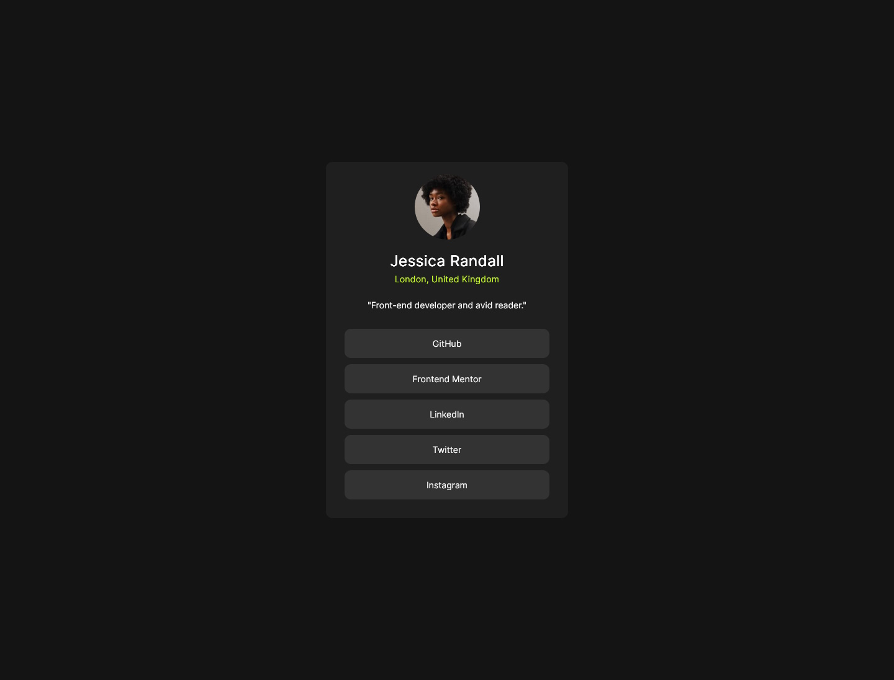
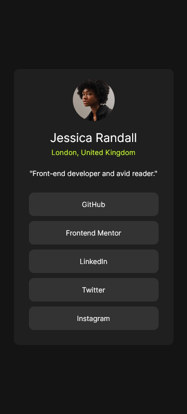

# Frontend Mentor - Social links profile solution

This is a solution to the [Social links profile challenge on Frontend Mentor](https://www.frontendmentor.io/challenges/social-links-profile-UG32l9m6dQ). Frontend Mentor challenges help you improve your coding skills by building realistic projects. 

## Table of contents

- [Overview](#overview)
  - [The challenge](#the-challenge)
  - [Screenshots](#screenshot-desktop)
- [My process](#my-process)
  - [Built with](#built-with)
  - [What I learned](#what-i-learned)
- [Author](#author)

## Overview

### The challenge

Users should be able to:

- See hover and focus states for all interactive elements on the page

### Screenshot Desktop



### Screenshot MobileView (VS Code, active state)



## My process

### Built with

- HTML
- CSS
- Flexbox

### What I learned

Using Flexbox on the body to center the whole div-container is done like this:

```html
<body>
    <div class="profile-container">
        <!-- content of the container in here -->
    </div>
</body>
```
```css
body {
    display: flex;
    justify-content: center;
    align-items: center;
}
```

## Author

- Frontend Mentor - [@theGamingKitten](https://www.frontendmentor.io/profile/theGamingKitten)